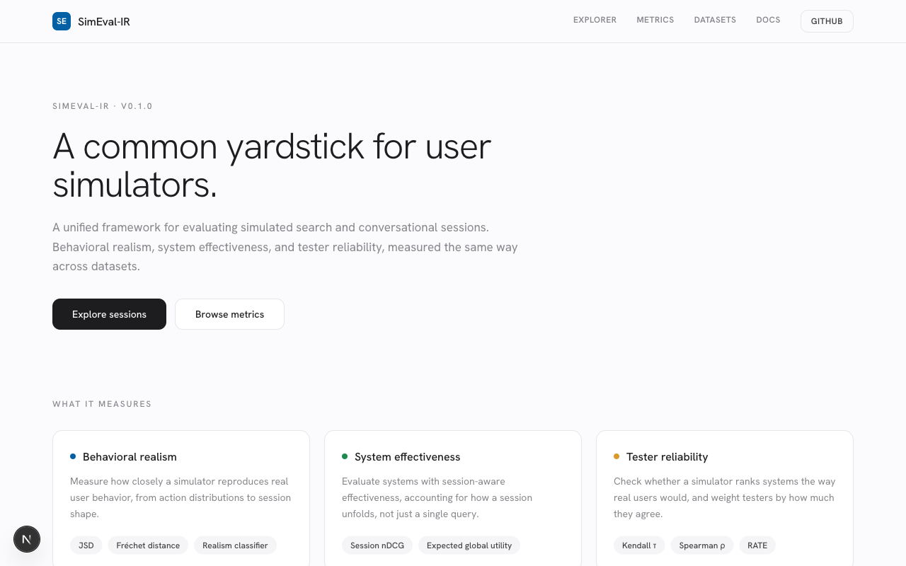

<div align="center">

# SimEval-IR

### A Unified Toolkit and Benchmark Suite for Evaluating User Simulators and Search Sessions

*Measure whether a user simulator behaves like real users and whether it ranks retrieval systems correctly, as two separate things.*

[](https://doi.org/10.1145/3805712.3808635)
[](https://doi.org/10.1145/3805712.3808635)
[](LICENSE)
[](https://www.python.org/downloads/)



**[Saber Zerhoudi](mailto:szerhoudi@acm.org)** · University of Passau
Published at the **49th International ACM SIGIR Conference (SIGIR '26), Melbourne, Australia** &nbsp;·&nbsp; pp. 3537–3543 &nbsp;·&nbsp; [Read the paper](https://doi.org/10.1145/3805712.3808635)

</div>

> **What is this?** User simulators are used to evaluate interactive retrieval systems, but two goals get conflated: matching real user behavior (realism) and producing valid system rankings (reliability). SimEval-IR is an open-source toolkit and benchmark suite that measures the two separately, over a single canonical session schema, with reproducible baselines.
>
> **Who is it for?** IR researchers who cite and extend simulator evaluations, and practitioners who need to validate a simulator before trusting its system rankings.

**Contents:** [Abstract](#abstract) · [Highlights](#highlights) · [Citation](#citation) · [Quick Start](#quick-start) · [Usage](#usage) · [Architecture](#architecture) · [Benchmarks](#benchmarks) · [Metrics](#metrics) · [Related Work](#related-work) · [License](#license)

## Abstract

> User simulators are increasingly central to interactive information retrieval, yet the community lacks standardized evaluation tools. Simulators serve two objectives, behavioral realism (matching real user behavior) and tester reliability (producing valid system rankings), and these are often conflated despite being distinct and sometimes conflicting. We present SimEval-IR, an open-source toolkit and benchmark suite that makes this distinction measurable. SimEval-IR provides: (1) a canonical session schema unifying session search and conversational interactions, with validated dataset adapters and explicit loss accounting; (2) three executable benchmarks covering behavioral realism, tester reliability with RATE-style estimation, and an analysis linking the two; and (3) baseline results across four real datasets in two languages and four simulator families. Our key finding: the classifier-discriminator "human-likeness" check, the dominant realism test in the literature, has essentially no pooled predictive power for system-ranking validity (r = +0.09, n = 48), while marginal click-depth distance and Fréchet distance over session embeddings give a much stronger signal (|r| = 0.43 and 0.40, p ≤ 0.005). SimEval-IR is released with all configurations and scripts to reproduce all reported analysis.

**Keywords:** information retrieval, evaluation, user simulation, session search, conversational IR, benchmark

## Highlights

- **Two objectives, measured apart:** behavioral realism and tester reliability are computed and reported as distinct scores, not merged into one "quality" number.
- **One canonical schema:** `InteractionSession` covers both session search and conversational interactions, with validated dataset adapters and explicit accounting of what each adapter drops.
- **Three executable benchmarks:** B1 (realism), B2 (tester reliability with RATE-style estimation), and B3 (the link between them), each runnable end to end from the shipped configs.
- **The dominant realism test predicts little:** the classifier "human-likeness" check has near-zero pooled correlation with ranking validity (r = +0.09, n = 48); click-depth and Fréchet distance carry a stronger signal (|r| = 0.43 and 0.40, p ≤ 0.005).
- **Reproducible baselines:** four real datasets in two languages (AOL, ORCAS, TREC Session 2014, MIRACL-zh) across four simulator families, with all scripts and configs included.

## Citation

If you use SimEval-IR in your research, please cite the paper:

```bibtex
@inproceedings{zerhoudi2026simevalir,
  author    = {Zerhoudi, Saber},
  title     = {SimEval-IR: A Unified Toolkit and Benchmark Suite for Evaluating User Simulators and Search Sessions},
  booktitle = {Proceedings of the 49th International ACM SIGIR Conference on Research and Development in Information Retrieval (SIGIR '26)},
  year      = {2026},
  pages     = {3537--3543},
  publisher = {ACM},
  address   = {Melbourne, VIC, Australia},
  doi       = {10.1145/3805712.3808635},
  url       = {https://doi.org/10.1145/3805712.3808635}
}
```

**ACM Reference Format:**
Saber Zerhoudi. 2026. SimEval-IR: A Unified Toolkit and Benchmark Suite for Evaluating User Simulators and Search Sessions. In *Proceedings of the 49th International ACM SIGIR Conference on Research and Development in Information Retrieval (SIGIR '26)*. ACM, Melbourne, VIC, Australia, 3537–3543. https://doi.org/10.1145/3805712.3808635

GitHub shows a "Cite this repository" button from [`CITATION.cff`](CITATION.cff).

## Quick Start

```bash
git clone https://github.com/searchsim-org/simeval-ir.git
cd simeval-ir
pip install -e .

# List the available metrics and evaluation protocols
simeval list-metrics
simeval list-protocols

# Compare real and simulated sessions on behavioral realism
simeval eval-behavior --real real.jsonl --sim sim.jsonl \
  --metrics jsd_action_types,session_length_distribution
```

## Installation

```bash
pip install simeval-ir
```

<details>
<summary>Optional dependency groups</summary>

```bash
pip install simeval-ir[ml]         # embeddings via transformers (Fréchet, classifier)
pip install simeval-ir[pyterrier]  # PyTerrier integration
pip install simeval-ir[dev]        # development and test tooling
```

</details>

## Usage

### Create a session programmatically

```python
from simeval_ir import InteractionSession, Event, EventType, SessionType, Click

session = InteractionSession(
    session_id="my-session",
    dataset_id="custom",
    session_type=SessionType.SEARCH,
    events=[
        Event(event_id="e1", type=EventType.QUERY_ISSUED, query="python tutorial"),
        Event(event_id="e2", type=EventType.CLICK,
              clicked_items=[Click(doc_id="doc1", rank=1)]),
    ],
)
```

### Load sessions and compute a metric

```python
from simeval_ir.datasets import load_sessions_from_jsonl
from simeval_ir.metrics import get_metric

real = list(load_sessions_from_jsonl("real.jsonl"))
sim = list(load_sessions_from_jsonl("sim.jsonl"))

jsd = get_metric("jsd_action_types")()
result = jsd.compute(real=real, sim=sim)
print(f"{result.name}: {result.value:.4f}")
```

### Run an evaluation protocol

```python
from simeval_ir.eval import run_protocol

result = run_protocol("realism-benchmark-v1", real=real, sim=sim)
for m in result.metric_results:
    print(f"{m.name}: {m.value:.4f}")
```

<details>
<summary>Data schema</summary>

Sessions use one canonical JSON schema for both search and conversational interactions:

```json
{
  "session_id": "session_1",
  "dataset_id": "my_dataset",
  "session_type": "search",
  "events": [
    {"event_id": "e1", "type": "query_issued", "query": "example query", "timestamp": 0.0},
    {"event_id": "e2", "type": "click",
     "clicked_items": [{"doc_id": "doc1", "rank": 1}], "timestamp": 1.5}
  ]
}
```

</details>

<details>
<summary>Custom dataset adapters</summary>

```python
from simeval_ir.datasets import DatasetAdapter, register_adapter

class MyDatasetAdapter(DatasetAdapter):
    name = "my-dataset"
    dataset_type = {"T"}   # traditional search
    domain = "web"

    def load_sessions(self, data_path, split="all"):
        for row in load_my_data(data_path):
            yield InteractionSession(...)

    def validate_data_path(self, data_path):
        return (data_path / "data.csv").exists()

register_adapter("my-dataset", MyDatasetAdapter)
```

</details>

## Architecture

| Component | Path | Role |
|-----------|------|------|
| Core types | `src/simeval_ir/core/` | `InteractionSession`, `Event`, canonical schema |
| Dataset adapters | `src/simeval_ir/datasets/adapters/` | Load real logs into the canonical schema with loss accounting |
| Metrics | `src/simeval_ir/metrics/` | Behavioral realism, system effectiveness, tester reliability |
| Integrations | `src/simeval_ir/integrations/` | SimIIR and PyTerrier bridges |
| CLI | `src/simeval_ir/cli/` | `simeval` command-line entry point |
| Benchmarks | `eval/scripts/`, `eval/configs/` | B1/B2/B3 runners and their configs |

<details>
<summary>SimIIR and PyTerrier integrations</summary>

```python
from simeval_ir.integrations.simiir import from_simiir_logs
sessions = from_simiir_logs("path/to/simiir/logs/")
```

Reproducible SimIIR runs are available through [`Sim4IA-Bench`](https://github.com/irgroup/Sim4IA-Bench), a containerized SimIIR-2.0 stack that pins click-model parameters. Convert its output into the canonical schema and feed it to the B1/B2/B3 pipeline:

```bash
python -m simeval_ir.integrations.simiir \
  --logs runs/simiir_pbm.jsonl \
  --output data/simiir_pbm.canonical.jsonl
```

```python
from simeval_ir.integrations.pyterrier import from_pyterrier_experiment, SimEvalEvaluator
sessions = from_pyterrier_experiment(topics, qrels, {"bm25": run_df})
evaluator = SimEvalEvaluator(metrics=["session_ndcg"])
results = evaluator.evaluate(run_df, qrels, topics)
```

</details>

## Benchmarks

Three executable benchmarks reproduce the paper's analysis over four real datasets in two languages.

| Benchmark | Question | Run |
|-----------|----------|-----|
| B1 | How realistic is the simulator's behavior? | `python eval/scripts/run_b1.py --real-path data/aol --real-adapter aol --sim-path data/simulated/realistic.jsonl --sim-name realistic --output results/b1` |
| B2 | How reliable is it as a system tester (RATE-style)? | `python eval/scripts/run_b2.py --rankings eval/configs/b2_orcas.yaml --output results/b2` |
| B3 | Does realism predict reliability? | `python eval/scripts/run_b3.py --b1-dir results/b1 --b2-results results/b2/b2_results.json --output results/b3` |

## Metrics

<details>
<summary>Behavioral realism</summary>

| Metric | Description |
|--------|-------------|
| `jsd_action_types` | JSD between action-type distributions |
| `session_fd` | Fréchet distance over session embeddings |
| `realism_classifier` | Classifier-based "human-likeness" score |
| `session_length_distribution` | KS test on session lengths |
| `timing_distribution` | KS test on inter-event times |

</details>

<details>
<summary>System effectiveness and tester reliability</summary>

| Metric | Description |
|--------|-------------|
| `session_ndcg` | Session-level nDCG |
| `egu` | Expected Global Utility |
| `kendall_tau` | Kendall's τ rank correlation |
| `spearman_rho` | Spearman's ρ rank correlation |
| `pearson_corr` | Pearson correlation |
| `rate` | RATE reliability estimation |

</details>

## Related Work

- **[SimIIR 2.0](https://github.com/irgroup/simiir)** (Zerhoudi et al., CIKM 2022): a framework for simulating interactive users and click behavior. SimEval-IR consumes SimIIR logs through its canonical schema and evaluates the resulting simulators rather than generating them.
- **RATE** (Labhishetty and Zhai, ECIR 2022): reliability-aware aggregation of system rankings under noisy testers. SimEval-IR uses RATE-style estimation as the B2 reliability metric.
- **Fréchet-distance realism** (Kusa et al., EACL 2024): distributional distance between real and simulated sessions. SimEval-IR includes it as a realism metric and shows it correlates with ranking validity where the classifier check does not.

## License

MIT License. See [LICENSE](LICENSE).

<details>
<summary>Project structure</summary>

```
src/simeval_ir/   Core library: core types, datasets, metrics, integrations, CLI
eval/scripts/     Benchmark runners (run_b1.py, run_b2.py, run_b3.py, generators)
eval/configs/     YAML configs for the B1/B2/B3 experiments
data/             Sample datasets and canonical-schema session files
results/          Benchmark outputs
tests/            Test suite
```

</details>
